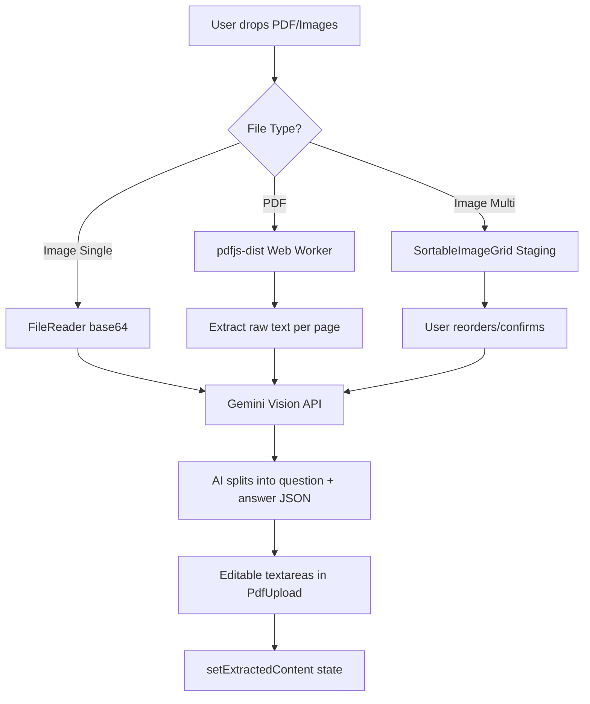
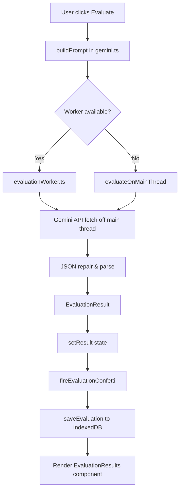

## Introduction

The JKPSC Answer Evaluator is a **fully client-side** single-page application (SPA) that runs entirely in the browser. There is no backend server - all processing, including PDF extraction, AI evaluation, and data storage happens on the user's device.

<Note>
**Live Domain:** [www.jkpscprep.com](https://www.jkpscprep.com)  
**Telegram:** [t.me/jkpscprepp](https://t.me/jkpscprepp)
</Note>

## Core Architecture Principles

### Client-Side Only

Every operation happens in the browser:

- **No backend API** - Direct API calls from browser to Google Gemini
- **No database server** - IndexedDB for local storage
- **No file uploads to servers** - PDF/image processing via Web Workers
- **Privacy-first** - User data never leaves their device

### Technology Foundation

```typescript
// src/App.tsx - Root component structure
import { BrowserRouter, Routes, Route } from "react-router-dom";
import { TooltipProvider } from "@/components/ui/tooltip";
import { Toaster } from "@/components/ui/toaster";
import Index from "./pages/Index";
import NotFound from "./pages/NotFound";

const App = () => (
  <TooltipProvider>
    <Toaster />
    <BrowserRouter>
      <Routes>
        <Route path="/" element={<Index />} />
        <Route path="*" element={<NotFound />} />
      </Routes>
    </BrowserRouter>
  </TooltipProvider>
);
```

## Component Hierarchy

### Application Structure

```
App.tsx (Root)
└── Index.tsx (Main Page - Single Page App)
    ├── ApiKeyManager
    │   └── Stores Gemini API key in localStorage
    │
    ├── SubjectMarksSelector
    │   └── Subject (GS1-4, Essay) + Marks (10/15/20/125) selection
    │
    ├── PdfUpload
    │   ├── File drag-drop zone
    │   ├── SortableImageGrid (multi-image reordering)
    │   ├── PDF.js extraction (pdfjs-dist)
    │   └── Gemini Vision AI transcription
    │
    ├── ShimmerButton ("Evaluate Answer")
    │   └── Triggers evaluation workflow
    │
    ├── EvaluationResults
    │   ├── Score card with NumberTicker animation
    │   ├── Tabbed interface (Scores | Key Points | Strengths | Tips | Model Answer)
    │   └── PDF download button
    │
    ├── EvalHistory
    │   ├── Collapsible history list from IndexedDB
    │   └── Export/Import JSON functionality
    │
    ├── ProgressDashboard (visible when history ≥ 2)
    │   ├── Score trend line chart (recharts)
    │   └── Subject average bar chart
    │
    └── TelegramPopup (one-time popup)
```

### State Management

All state lives in `src/pages/Index.tsx` - **no global state management library**. State is managed via React hooks:

```typescript
// Core application state (from Index.tsx)
const [apiKey, setApiKey] = useState<string | null>(null);
const [subject, setSubject] = useState<'GS1' | 'GS2' | 'GS3' | 'GS4' | 'Essay' | null>(null);
const [marks, setMarks] = useState<10 | 15 | 20 | 125 | null>(null);
const [extractedContent, setExtractedContent] = useState<ExtractedContent | null>(null);
const [isEvaluating, setIsEvaluating] = useState(false);
const [result, setResult] = useState<EvaluationResult | null>(null);
const [isDark, setIsDark] = useState(() => localStorage.getItem('theme') === 'dark');
```

<Info>
The `canEvaluate` derived state ensures all 4 inputs (API key, subject, marks, and extracted content) are present before enabling the Evaluate button.
</Info>

## Data Flow Architecture

### 1. Answer Upload Flow



### 2. Evaluation Flow



### 3. Storage Architecture

```typescript
// localStorage (small, synchronous data)
localStorage.setItem('theme', 'dark' | 'light');
localStorage.setItem('gemini_api_key', JSON.stringify({ mode: 'plain', key: '...' }));
localStorage.setItem('jkpscprep_tg_dismissed', '1');

// IndexedDB (unlimited eval history via idb package)
// src/lib/historyDb.ts
import { openDB } from 'idb';

const db = await openDB('jkpscprep', 1, {
  upgrade(db) {
    const store = db.createObjectStore('evaluations', { keyPath: 'id' });
    store.createIndex('by_timestamp', 'timestamp');
    store.createIndex('by_subject', 'subject');
  },
});
```

<Warning>
The old `jkpscprep_eval_history` localStorage key is automatically migrated to IndexedDB on first load and then removed. This is a one-way migration.
</Warning>

## Module Organization

### Core Logic Modules

| Module | Purpose | Location |
|--------|---------|----------|
| **gemini.ts** | AI evaluation logic, prompt builders, API calls | `src/lib/gemini.ts` |
| **pdfGenerator.tsx** | PDF report generation (lazy-loaded) | `src/lib/pdfGenerator.tsx` |
| **historyDb.ts** | IndexedDB wrapper (async CRUD) | `src/lib/historyDb.ts` |
| **gsap.ts** | GSAP animation registration | `src/lib/gsap.ts` |
| **utils.ts** | Tailwind class merge utility | `src/lib/utils.ts` |

### Data Layer

```
src/data/
├── questionBank.ts        # Subject definitions & valid mark options
├── rubrics.ts             # Generic rubric fallbacks
├── gs1Rubrics.ts          # GS1 block rubrics + identifyGS1Block()
├── gs1KeyPoints.ts        # GS1 topic key points
├── gs2Rubrics.ts          # GS2 section rubrics
├── gs2KeyPoints.ts
├── gs3Rubrics.ts
├── gs3KeyPoints.ts
├── gs4Rubrics.ts          # Includes case_study section
├── gs4KeyPoints.ts
└── essayRubrics.ts        # 4-section essay structure
```

### Prompt Building Pipeline

The evaluation system uses subject-specific prompt builders:

```typescript
// src/lib/gemini.ts
export const buildPrompt = (params: EvaluationParams): string => {
  switch (params.subject) {
    case 'Essay': return buildEssayPrompt(params);
    case 'GS1': return buildGS1Prompt(params);
    case 'GS2': return buildGS2Prompt(params);
    case 'GS3': return buildGS3Prompt(params);
    case 'GS4': return buildGS4Prompt(params);
  }
};

// Each builder:
// 1. Identifies topic block/section from question text
// 2. Loads matching rubric (syllabus, non-negotiables, PESTEL dimensions)
// 3. Loads matching key points (mustMention, technicalTerms, diagrams)
// 4. Enforces 70% ceiling rule: overallScore ≤ floor(marks × 0.7)
```

## Error Handling

### Error Boundaries

Every major section is wrapped in an error boundary to prevent full-page crashes:

```typescript
// src/components/ErrorBoundary.tsx
<ErrorBoundary name="Evaluation Results">
  <EvaluationResults {...props} />
</ErrorBoundary>
```

The fallback UI shows the section name and a "Try Again" button that resets the error state.

### JSON Response Parsing

The evaluation response parser handles malformed/truncated JSON in 3 stages:

1. **Direct parse** - Strip markdown fences and parse
2. **Auto-repair** - Count unclosed `{` and `[`, append matching closers
3. **Regex extraction** - Extract individual fields as last-resort fallback

```typescript
// Worker implements same logic (src/workers/evaluationWorker.ts)
const result = repairAndParse(textContent) ?? regexFallback(textContent, marks);
```

## Animation Architecture

### Dual Animation System

Two animation libraries coexist without conflict:

**GSAP** (page-level, registered in `src/lib/gsap.ts`):
- Hero entrance: `.hero-badge`, `.hero-title`, `.hero-subtitle`
- Scroll reveal: `.scroll-section` with ScrollTrigger batch
- Score card: `.score-card`, `.trophy-icon`, result tabs
- Evaluate button: scale bounce on click, pulse on hover

**motion/react v12** (Magic UI components):
- `ScrollProgress` - `useScroll` → `scaleX` animation
- `MagicCard` - `useMotionValue` pointer tracking
- `ShimmerButton` - CSS keyframe animations
- `NumberTicker` - `useSpring` + `useInView`

<Info>
All animations respect `prefersReducedMotion()` - confetti and GSAP animations are skipped when the user has reduced motion enabled.
</Info>

## Progressive Web App (PWA)

### Service Worker Strategy

Registered in `src/main.tsx`:

```typescript
window.addEventListener('load', () => {
  if ('serviceWorker' in navigator) {
    navigator.serviceWorker.register('/sw.js');
  }
});
```

**Caching Strategy** (`public/sw.js`):

| Request Type | Strategy |
|--------------|----------|
| Same-origin assets (JS, CSS, app shell) | **Cache-first** - serve from cache, update in background |
| `generativelanguage.googleapis.com` | **Network-only** - never cache AI responses |
| Other cross-origin | **Network-first** with cache fallback |

**Pre-cached on install:**
- `/`, `/index.html`, `/site.webmanifest`
- Favicon assets, `/logo.png`

## Build Configuration

```typescript
// vite.config.ts
export default defineConfig({
  server: {
    host: "::",
    port: 8080,
  },
  plugins: [react()],
  resolve: {
    alias: {
      "@": path.resolve(__dirname, "./src"),
    },
  },
  build: {
    target: "esnext",
  },
});
```

- **Build tool:** Vite 5
- **Package manager:** bun (use `bun add`, not npm/yarn)
- **Path alias:** `@/` resolves to `src/`
- **Target:** esnext for modern browsers

## Accessibility Features

- **Skip-to-content link** - Fixed at top, visible on keyboard focus
- **Drop zone keyboard support** - `role="button"`, Enter/Space triggers file input
- **`aria-live="polite"`** on score card for screen reader announcements
- **`aria-label`** attributes on all icon-only buttons
- **Reduced motion support** - All animations skipped when user preference is set

## Next Steps

<CardGroup cols={2}>
  <Card title="Tech Stack" icon="layer-group" href="/technical/tech-stack">
    Complete breakdown of all dependencies, versions, and purposes
  </Card>
  <Card title="Client-Side Processing" icon="microchip" href="/technical/client-side-processing">
    Deep dive into Web Workers, IndexedDB, and browser-only architecture
  </Card>
</CardGroup>