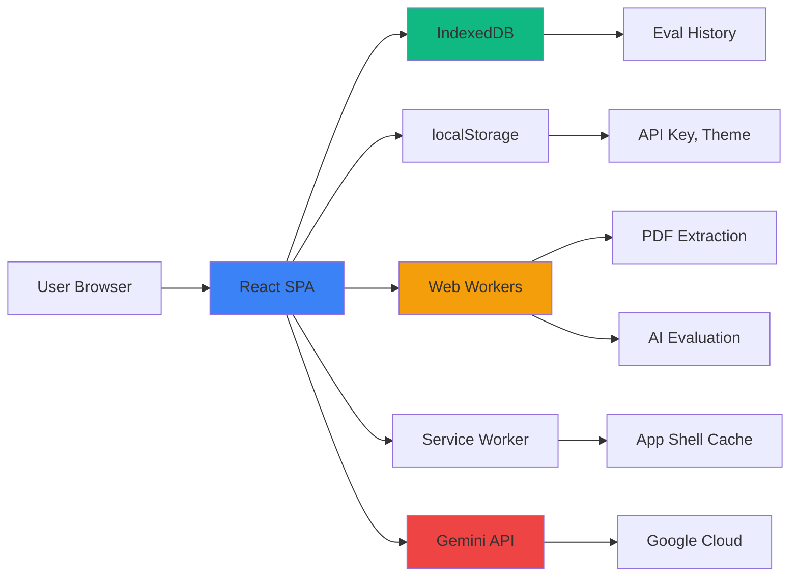
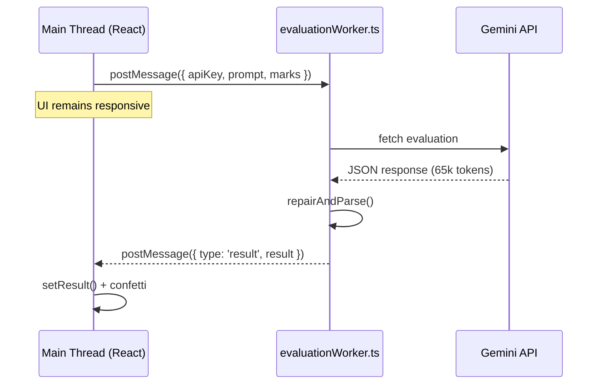

## Why Client-Side Only?

The JKPSC Answer Evaluator runs **entirely in the browser** with zero backend infrastructure. This architectural decision provides:

<AccordionGroup>
  <Accordion title="Privacy & Security">
    - User's answer sheets never leave their device
    - API keys stored locally, never sent to our servers
    - No data collection, tracking, or analytics
    - Complete GDPR compliance by design
  </Accordion>
  
  <Accordion title="Zero Operating Costs">
    - No server hosting fees
    - No database management
    - No API gateway costs
    - Infinitely scalable without infrastructure
  </Accordion>
  
  <Accordion title="Offline Capability">
    - Service Worker caches app shell
    - Works offline after first load (except AI evaluation)
    - History/data persists in IndexedDB
    - No network dependency for UI
  </Accordion>
  
  <Accordion title="Performance">
    - No server round-trips for app logic
    - Instant UI updates
    - Web Workers for parallel processing
    - Direct API calls (no proxy latency)
  </Accordion>
</AccordionGroup>

## Architecture Overview



## PDF & Image Processing

### PDF Extraction with pdfjs-dist

**All PDF parsing happens in-browser using Mozilla's PDF.js library.**

```typescript
// src/components/PdfUpload.tsx
import * as pdfjsLib from 'pdfjs-dist';

// Configure worker (runs in separate thread)
pdfjsLib.GlobalWorkerOptions.workerSrc = new URL(
  'pdfjs-dist/build/pdf.worker.mjs',
  import.meta.url
).toString();

const extractPdfText = async (file: File): Promise<string> => {
  const arrayBuffer = await file.arrayBuffer();
  const pdf = await pdfjsLib.getDocument({ data: arrayBuffer }).promise;
  
  let fullText = '';
  for (let i = 1; i <= pdf.numPages; i++) {
    const page = await pdf.getPage(i);
    const textContent = await page.getTextContent();
    const pageText = textContent.items
      .map((item: any) => item.str)
      .join(' ');
    fullText += pageText + '\n\n';
  }
  
  return fullText;
};
```

<Info>
The PDF.js worker runs in a separate thread, keeping the UI responsive during extraction. Large PDFs (50+ pages) extract without freezing the interface.
</Info>

### Image Transcription with Gemini Vision

**Handwritten answers are OCR'd using Google's Gemini Vision API.**

#### Single Image Flow

```typescript
// Convert to base64
const reader = new FileReader();
reader.readAsDataURL(imageFile);
const base64 = await new Promise((resolve) => {
  reader.onload = () => resolve(reader.result);
});

// Send to Gemini Vision API
const response = await fetch(
  `https://generativelanguage.googleapis.com/v1beta/models/gemini-2.5-flash:generateContent?key=${apiKey}`,
  {
    method: 'POST',
    headers: { 'Content-Type': 'application/json' },
    body: JSON.stringify({
      contents: [{
        parts: [
          { text: transcriptionPrompt },
          { inline_data: { mime_type: mimeType, data: base64Data } }
        ]
      }]
    })
  }
);
```

#### Multi-Image Staging & Reordering

**When multiple images are uploaded, they enter a staging area for reordering:**

```typescript
// User drops 3 images → staged, not processed yet
const [pendingImages, setPendingImages] = useState<File[]>([]);

const handleMultipleImages = (files: File[]) => {
  setPendingImages(files);
  // Show SortableImageGrid with drag-to-reorder
};

// User drags images to correct order, then clicks "Confirm & Transcribe"
const handleConfirmImages = async () => {
  const orderedFiles = pendingImages; // After reordering
  
  // Process in order
  for (const file of orderedFiles) {
    const extracted = await transcribeImage(file, apiKey);
    // Concatenate results
  }
};
```

**AI Transcription Prompt** (multi-image aware):

```typescript
const prompt = `You are receiving ${imageCount} images that may be in any order.

TASK:
1. Scan all images to locate the question
2. Determine correct reading order (page numbers / "contd." / sentence flow)
3. OCR in correct order
4. Output JSON: { "question": "...", "answer": "..." }

Handle handwriting, diagrams, maps, tables.
Use [DIAGRAM: ...], [MAP: ...], [TABLE: ...] inline tags for non-text content.`;
```

<Warning>
Maximum file size: **10MB per image**. Multiple images supported for answers, but PDFs are single-file only.
</Warning>

### Editable Extraction Results

After transcription, both question and answer are rendered as **editable textareas**:

```tsx
// PdfUpload.tsx - Success panel
{extractedContent && (
  <div className="space-y-4">
    <div>
      <label className="text-sm font-semibold">Extracted Question</label>
      <Textarea
        value={extractedContent.question}
        onChange={(e) => setExtractedContent(prev => ({
          ...prev!,
          question: e.target.value
        }))}
        rows={3}
      />
    </div>
    <div>
      <label className="text-sm font-semibold">Extracted Answer</label>
      <Textarea
        value={extractedContent.answer}
        onChange={(e) => setExtractedContent(prev => ({
          ...prev!,
          answer: e.target.value
        }))}
        rows={8}
      />
    </div>
  </div>
)}
```

<Info>
This lets users fix OCR mistakes or add content the AI missed before clicking Evaluate.
</Info>

## AI Evaluation with Web Workers

### Why Web Workers?

Gemini API evaluations take **30-60 seconds**. Running this on the main thread would freeze the UI. Solution: **Web Workers**.



### Worker Implementation

```typescript
// src/workers/evaluationWorker.ts
self.onmessage = async (event: MessageEvent<WorkerInput>) => {
  const { apiKey, prompt, marks } = event.data;
  
  try {
    const response = await fetch(
      `https://generativelanguage.googleapis.com/v1beta/models/gemini-3-flash-preview:generateContent?key=${apiKey}`,
      {
        method: 'POST',
        headers: { 'Content-Type': 'application/json' },
        body: JSON.stringify({
          contents: [{ parts: [{ text: prompt }] }],
          generationConfig: {
            temperature: 0.3,
            maxOutputTokens: 65536
          }
        })
      }
    );
    
    const data = await response.json();
    const textContent = data.candidates?.[0]?.content?.parts?.[0]?.text;
    
    // JSON repair pipeline (self-contained in worker)
    const result = repairAndParse(textContent) ?? regexFallback(textContent, marks);
    
    if (result) {
      self.postMessage({ type: 'result', result });
    } else {
      self.postMessage({ type: 'error', message: 'Failed to parse' });
    }
  } catch (err) {
    self.postMessage({ type: 'error', message: err.message });
  }
};
```

### Main Thread Fallback

```typescript
// src/lib/gemini.ts
export const evaluateAnswer = async (params: EvaluationParams) => {
  const prompt = buildPrompt(params);
  
  // Try worker first
  if (typeof Worker !== 'undefined') {
    try {
      const result = await runInWorker(params.apiKey, prompt, params.marks);
      return result;
    } catch (workerErr) {
      console.warn('[gemini] Worker failed, falling back to main thread:', workerErr);
      // Fall through to main-thread implementation below
    }
  }
  
  // Fallback: evaluateOnMainThread()
  return evaluateOnMainThread(params.apiKey, prompt, params.marks, params);
};
```

<Note>
Some privacy-focused browsers (Brave, Tor) disable Workers. The main-thread fallback ensures the app still works, just with a frozen UI during evaluation.
</Note>

### JSON Repair Pipeline

Gemini responses are often truncated or malformed. **3-stage repair:**

```typescript
// Stage 1: Direct parse after stripping markdown fences
function stripFences(raw: string): string {
  let s = raw.trim();
  if (s.startsWith('```json')) s = s.slice(7);
  else if (s.startsWith('```')) s = s.slice(3);
  if (s.endsWith('```')) s = s.slice(0, -3);
  return s.trim();
}

try {
  return JSON.parse(stripFences(textContent));
} catch { /* continue */ }

// Stage 2: Balance brackets/braces
function balanceBrackets(json: string): string {
  const openBraces = (json.match(/{/g) || []).length;
  const closeBraces = (json.match(/}/g) || []).length;
  const openBrackets = (json.match(/\[/g) || []).length;
  const closeBrackets = (json.match(/]/g) || []).length;
  
  for (let i = 0; i < openBrackets - closeBrackets; i++) json += ']';
  for (let i = 0; i < openBraces - closeBraces; i++) json += '}';
  
  return json;
}

try {
  return JSON.parse(balanceBrackets(json));
} catch { /* continue */ }

// Stage 3: Regex extraction as last resort
function regexFallback(raw: string, marks: number): EvaluationResult {
  const overallScore = parseFloat(
    raw.match(/"overallScore"\s*:\s*(\d+(?:\.\d+)?)/)?.[1] ?? '0'
  );
  
  // Extract categories, keyPoints, tips, etc. via regex
  // ...
  
  return { overallScore, maxScore: marks, ... };
}
```

<Info>
**Test coverage:** `jsonRepair.test.ts` has 11 tests covering all 3 stages, including truncated arrays, missing closers, and completely malformed JSON.
</Info>

## Client-Side Storage

### localStorage (Synchronous, Small Data)

**Used for:**
- API key (`gemini_api_key`)
- Theme preference (`theme`)
- Telegram popup dismissal (`jkpscprep_tg_dismissed`)

```typescript
// API key storage (plain JSON)
localStorage.setItem('gemini_api_key', JSON.stringify({
  mode: 'plain',
  key: 'AIza...'
}));

// Theme
localStorage.setItem('theme', 'dark' | 'light');

// Popup dismissed
localStorage.setItem('jkpscprep_tg_dismissed', '1');
```

<Warning>
**Legacy migration:** Old `{ mode: 'encrypted', ... }` API key records are automatically cleared on load. PIN protection was removed.
</Warning>

### IndexedDB (Asynchronous, Unlimited Data)

**Used for:** Evaluation history (unlimited entries)

```typescript
// src/lib/historyDb.ts
import { openDB, DBSchema } from 'idb';

interface JKPSCPrepDB extends DBSchema {
  evaluations: {
    key: string; // UUID
    value: HistoryEntry;
    indexes: {
      'by_timestamp': number;
      'by_subject': string;
    };
  };
}

const db = await openDB<JKPSCPrepDB>('jkpscprep', 1, {
  upgrade(db) {
    const store = db.createObjectStore('evaluations', { keyPath: 'id' });
    store.createIndex('by_timestamp', 'timestamp');
    store.createIndex('by_subject', 'subject');
  },
});

// CRUD operations
export async function getAllEntries(): Promise<HistoryEntry[]> {
  const db = await getDb();
  return db.getAll('evaluations');
}

export async function putEntry(entry: HistoryEntry): Promise<void> {
  const db = await getDb();
  await db.put('evaluations', entry);
}

export async function deleteEntryById(id: string): Promise<void> {
  const db = await getDb();
  await db.delete('evaluations', id);
}
```

**Migration from localStorage:**

```typescript
// src/hooks/useEvalHistory.ts
useEffect(() => {
  const migrateFromLocalStorage = async () => {
    const old = localStorage.getItem('jkpscprep_eval_history');
    if (old) {
      const entries = JSON.parse(old);
      for (const entry of entries) {
        await putEntry(entry);
      }
      localStorage.removeItem('jkpscprep_eval_history');
    }
  };
  
  migrateFromLocalStorage();
}, []);
```

### History Entry Schema

```typescript
interface HistoryEntry {
  id: string;              // UUID v4
  timestamp: number;       // Date.now()
  subject: string;         // 'GS1' | 'GS2' | 'GS3' | 'GS4' | 'Essay'
  marks: number;           // 10 | 15 | 20 | 125
  question: string;        // Truncated to 100 chars for list display
  result: EvaluationResult; // Full evaluation object
}
```

**Export/Import functionality:**

```typescript
// Export all history as JSON
const exportHistory = () => {
  const dataStr = JSON.stringify(history, null, 2);
  const blob = new Blob([dataStr], { type: 'application/json' });
  const url = URL.createObjectURL(blob);
  const a = document.createElement('a');
  a.href = url;
  a.download = `jkpscprep_history_${new Date().toISOString().split('T')[0]}.json`;
  a.click();
};

// Import history (merge or replace)
const importHistory = async (file: File, mode: 'merge' | 'replace') => {
  const text = await file.text();
  const imported = JSON.parse(text);
  
  if (mode === 'replace') {
    await clearAllEntries();
  }
  
  for (const entry of imported) {
    await putEntry(entry);
  }
};
```

## Service Worker & PWA

### App Shell Caching

```javascript
// public/sw.js
const CACHE_NAME = 'jkpscprep-v1';
const urlsToCache = [
  '/',
  '/index.html',
  '/site.webmanifest',
  '/logo.png',
  '/favicon.ico'
];

self.addEventListener('install', (event) => {
  event.waitUntil(
    caches.open(CACHE_NAME)
      .then((cache) => cache.addAll(urlsToCache))
  );
});
```

### Fetch Strategy

```javascript
self.addEventListener('fetch', (event) => {
  const { request } = event;
  const url = new URL(request.url);
  
  // NEVER cache Gemini API responses
  if (url.hostname === 'generativelanguage.googleapis.com') {
    event.respondWith(fetch(request));
    return;
  }
  
  // Same-origin: Cache-first (app shell)
  if (url.origin === self.location.origin) {
    event.respondWith(
      caches.match(request)
        .then((response) => response || fetch(request))
    );
    return;
  }
  
  // Cross-origin: Network-first with cache fallback
  event.respondWith(
    fetch(request)
      .catch(() => caches.match(request))
  );
});
```

<Note>
The app works **offline** for all UI/history operations. Only AI evaluation requires network (Gemini API).
</Note>

### PWA Manifest

```json
// public/site.webmanifest
{
  "name": "JKPSC Answer Evaluator",
  "short_name": "JKPSC Prep",
  "start_url": "/",
  "display": "standalone",
  "background_color": "#ffffff",
  "theme_color": "#EF4444",
  "icons": [
    {
      "src": "/logo-192.png",
      "sizes": "192x192",
      "type": "image/png"
    },
    {
      "src": "/logo-512.png",
      "sizes": "512x512",
      "type": "image/png"
    }
  ]
}
```

## Performance Optimizations

### Code Splitting & Lazy Loading

**PDF generator is lazy-loaded** (only when user downloads report):

```typescript
// Index.tsx - Inside download handler
const handleDownloadPdf = async () => {
  const { downloadPdf } = await import('@/lib/pdfGenerator');
  await downloadPdf({ result, subject, marks, question, answer });
};
```

This saves **~200KB** from initial bundle.

### Web Worker for PDF Extraction

pdfjs-dist automatically uses a Web Worker:

```typescript
pdfjsLib.GlobalWorkerOptions.workerSrc = new URL(
  'pdfjs-dist/build/pdf.worker.mjs',
  import.meta.url
).toString();
```

<Info>
Vite's `import.meta.url` pattern ensures the worker is correctly bundled and deployed.
</Info>

### Debounced Edits

Extracted content textareas update state immediately (no debouncing) for instant validation feedback.

## Security Considerations

### API Key Storage

**Plain text in localStorage** (no encryption)

```typescript
// ApiKeyManager.tsx
const saveKey = (key: string) => {
  localStorage.setItem('gemini_api_key', JSON.stringify({
    mode: 'plain',
    key
  }));
};
```

<Warning>
**Why no encryption?** Encrypting with a user-entered PIN stored in localStorage provides zero security (the decryption key is on the same device). We chose transparency over security theater.
</Warning>

**Best practice:**
- Users should use a **restricted API key** from Google Cloud Console
- Restrict key to `generativelanguage.googleapis.com` only
- Set daily spending limits

### XSS Protection

React's JSX automatically escapes user input:

```tsx
{/* Safe - React escapes HTML entities */}
<p>{extractedContent.answer}</p>
```

### CORS & CSP

No custom CORS or CSP headers needed - all API calls are client-initiated to Google's CORS-enabled endpoints.

## Browser Requirements

<Check>Supported Features Required:</Check>

- **IndexedDB** - For eval history
- **Web Workers** - For PDF extraction and AI evaluation (fallback available)
- **Service Workers** - For PWA/offline support (optional)
- **FileReader API** - For image base64 encoding
- **Async/Await** - Modern JavaScript (ES2020+)
- **CSS Custom Properties** - For theming
- **localStorage** - For settings

**Minimum browser versions:**
- Chrome/Edge 90+
- Firefox 88+
- Safari 14+
- iOS Safari 14+
- Chrome Android 90+

## Debugging Client-Side Operations

### IndexedDB Inspection

**Chrome DevTools:**
1. F12 → Application tab
2. IndexedDB → jkpscprep → evaluations
3. View all entries, edit, delete

### Service Worker Debugging

**Chrome DevTools:**
1. F12 → Application tab
2. Service Workers section
3. Unregister, Update, Inspect worker console

### Web Worker Debugging

```typescript
// Add console.log inside worker
self.onmessage = async (event) => {
  console.log('[Worker] Received:', event.data);
  // ...
};
```

Worker logs appear in **main DevTools console** (not separate window).

### Network Inspection

Filter network tab by:
- `generativelanguage.googleapis.com` - Gemini API calls
- `pdf.worker` - PDF.js worker script

## Limitations of Client-Side Architecture

<Warning>Trade-offs to be aware of:</Warning>

| Limitation | Impact | Mitigation |
|------------|--------|------------|
| **API key exposed** | Visible in localStorage, network tab | Use restricted keys, spending limits |
| **No server-side validation** | Malicious users could craft requests | Gemini API has built-in safety filters |
| **Browser compatibility** | Older browsers unsupported | Clear minimum requirements in docs |
| **No cross-device sync** | History doesn't sync across devices | Export/Import JSON functionality |
| **Large file processing** | 10MB limit per image | Documented limit, compress before upload |
| **Web Worker availability** | Some privacy browsers disable | Main-thread fallback implemented |

## Future Enhancements

<CardGroup cols={2}>
  <Card title="WebAssembly PDF Parsing" icon="bolt">
    Replace pdfjs-dist with a WASM-based parser for 3-5x faster extraction
  </Card>
  
  <Card title="Shared Worker for History" icon="share-nodes">
    Use SharedWorker to sync history across multiple tabs in real-time
  </Card>
  
  <Card title="Web Crypto API Encryption" icon="lock">
    Encrypt IndexedDB with device-bound key (better than localStorage PIN)
  </Card>
  
  <Card title="Background Sync API" icon="cloud-arrow-up">
    Queue evaluations for offline processing when connection returns
  </Card>
</CardGroup>

## Related Documentation

<CardGroup cols={2}>
  <Card title="Architecture" icon="sitemap" href="/technical/architecture">
    High-level application structure and component hierarchy
  </Card>
  <Card title="Tech Stack" icon="layer-group" href="/technical/tech-stack">
    Complete breakdown of all libraries and dependencies
  </Card>
</CardGroup>